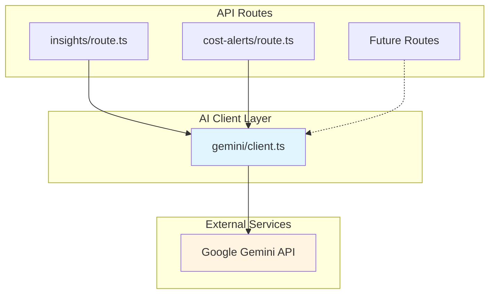
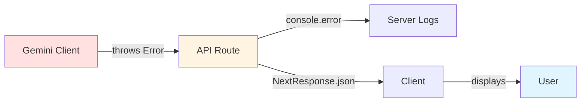

# Design Document: Migrate Z.ai to Google Gemini AI

## Overview

This design document specifies the technical implementation for migrating the AI integration from Z.ai (ilmu-glm-5.1 model) to Google Gemma AI (gemma-4-26b-a4b-it model). The migration replaces the existing Z.ai client library with the official Google Gen AI SDK while maintaining backward compatibility with existing API routes.

### Goals

- Replace Z.ai client with Google Gemma AI client using the official `@google/genai` SDK
- Maintain identical API interfaces for existing routes (insights and cost-alerts)
- Support both text completion and vision tasks for future Phase 1 features
- Ensure zero breaking changes to consuming code
- Remove all Z.ai dependencies and configuration

### Non-Goals

- Modifying the behavior or response format of existing AI routes
- Implementing new AI features beyond the current scope
- Optimizing AI prompt engineering or response quality
- Adding new configuration options beyond what Z.ai supported

## Architecture

### High-Level Architecture



### Migration Strategy

The migration follows a **drop-in replacement** pattern:

1. **Install** the `@google/genai` package
2. **Create** a new Gemma client at `src/lib/gemini/client.ts` with identical exports to the Z.ai client
3. **Update** environment variables from Z.ai to Gemini
4. **Replace** imports in active routes from `@/lib/zai/client` to `@/lib/gemini/client`
5. **Remove** Z.ai client code and dependencies
6. **Verify** functionality through manual testing

This approach minimizes risk by maintaining API compatibility and allowing for easy rollback if needed.

## Components and Interfaces

### Gemini Client Module

**Location**: `src/lib/gemini/client.ts`

**Purpose**: Provides a unified interface for interacting with Google Gemini AI, supporting both text completions and vision tasks.

#### Exported Types

```typescript
export interface GeminiMessage {
  role: 'system' | 'user' | 'assistant'
  content: string
}

export interface GeminiOptions {
  temperature?: number
  max_tokens?: number
  stream?: boolean
}
```

#### Exported Functions

##### `callGemini(messages: GeminiMessage[], options?: GeminiOptions): Promise<string>`

**Purpose**: Generate text completions using the Gemini API.

**Parameters**:
- `messages`: Array of conversation messages with role and content
- `options`: Optional configuration for temperature, max_tokens, and streaming

**Returns**: Promise resolving to the generated text content

**Behavior**:
- Converts messages array to Gemini's expected format
- Handles system instructions by extracting them from messages with role='system'
- Uses `gemini-3.1-flash-lite` model
- Applies default values: temperature=0.7, max_tokens=1000
- Throws descriptive errors on API failures

##### `callGeminiWithImage(prompt: string, imageBase64: string, mimeType?: string): Promise<string>`

**Purpose**: Generate text responses based on image and text input (vision task).

**Parameters**:
- `prompt`: Text prompt describing the task
- `imageBase64`: Base64-encoded image data (without data URI prefix)
- `mimeType`: MIME type of the image (default: 'image/jpeg')

**Returns**: Promise resolving to the generated text content

**Behavior**:
- Converts base64 image to Gemini's inline data format
- Supports JPEG, PNG, and WebP formats
- Uses `gemini-3.1-flash-lite` model
- Throws error for unsupported MIME types
- Throws descriptive errors on API failures

### Message Format Conversion

#### Z.ai Format (OpenAI-compatible)
```json
{
  "model": "ilmu-glm-5.1",
  "messages": [
    {"role": "system", "content": "You are a helpful assistant"},
    {"role": "user", "content": "Hello"}
  ],
  "temperature": 0.7,
  "max_tokens": 1000
}
```

#### Gemini SDK Format
```typescript
// System instruction extracted separately
const systemInstruction = "You are a helpful assistant";

// User/assistant messages converted to Content objects
const contents = [
  {
    role: "user",
    parts: [{ text: "Hello" }]
  }
];

// Model configuration
const generationConfig = {
  temperature: 0.7,
  maxOutputTokens: 1000
};
```

**Conversion Logic**:
1. Extract all messages with `role='system'` and combine into system instruction
2. Convert remaining messages to Gemini Content format
3. Map `role` values: 'user' → 'user', 'assistant' → 'model'
4. Wrap text content in `parts` array with `text` property
5. Map `max_tokens` to `maxOutputTokens`

### Response Extraction

**Gemini Response Structure**:
```typescript
{
  response: {
    candidates: [{
      content: {
        parts: [{ text: "Generated response" }],
        role: "model"
      },
      finishReason: "STOP",
      safetyRatings: [...]
    }]
  }
}
```

**Extraction Logic**:
1. Access `result.response.candidates[0].content.parts`
2. Concatenate all `text` fields from parts array
3. Throw error if candidates array is empty or undefined
4. Return concatenated text string

## Data Models

### Environment Variables

| Variable | Type | Required | Description | Example |
|----------|------|----------|-------------|---------|
| `GEMINI_API_KEY` | string | Yes | Google Gemini API authentication key | `AIzaSy...` |

**Removed Variables**:
- `ZAI_API_KEY` (no longer needed)
- `ZAI_API_BASE_URL` (no longer needed)

### Configuration Objects

#### GenerationConfig
```typescript
interface GenerationConfig {
  temperature?: number        // 0.0 to 2.0, default 0.7
  maxOutputTokens?: number   // Max tokens to generate, default 1000
  topK?: number              // Not used in current implementation
  topP?: number              // Not used in current implementation
  stopSequences?: string[]   // Not used in current implementation
}
```

#### InlineDataPart (for vision tasks)
```typescript
interface InlineDataPart {
  inlineData: {
    mimeType: string          // 'image/jpeg' | 'image/png' | 'image/webp'
    data: string              // Base64-encoded image data
  }
}
```

## Error Handling

### Error Categories

#### 1. Authentication Errors
**Cause**: Invalid or missing `GEMINI_API_KEY`

**Detection**: API returns 401 or 403 status

**Handling**:
```typescript
throw new Error(`Gemini API authentication error: ${response.status}`)
```

**User Impact**: API route returns 500 with generic error message

#### 2. API Request Errors
**Cause**: Network issues, rate limits, or invalid requests

**Detection**: API returns 4xx or 5xx status codes

**Handling**:
```typescript
if (!response.ok) {
  throw new Error(`Gemini API error: ${response.status} ${response.statusText}`)
}
```

**User Impact**: API route returns 500 with "Failed to generate insight/alerts" message

#### 3. Empty Response Errors
**Cause**: Gemini returns no candidates or empty content

**Detection**: `response.candidates` is undefined or empty

**Handling**:
```typescript
if (!result.response.candidates || result.response.candidates.length === 0) {
  throw new Error('Gemini API returned empty response')
}
```

**User Impact**: API route returns 500 with generic error message

#### 4. Unsupported MIME Type Errors
**Cause**: Vision function called with unsupported image format

**Detection**: `mimeType` not in ['image/jpeg', 'image/png', 'image/webp']

**Handling**:
```typescript
const supportedTypes = ['image/jpeg', 'image/png', 'image/webp']
if (!supportedTypes.includes(mimeType)) {
  throw new Error(`Unsupported image format: ${mimeType}. Supported: ${supportedTypes.join(', ')}`)
}
```

**User Impact**: API route returns 500 with descriptive error message

### Error Propagation



**Error Flow**:
1. Gemini client throws descriptive error
2. API route catches error in try-catch block
3. Error logged to console with `console.error()`
4. API route returns `NextResponse.json({ error: 'Generic message' }, { status: 500 })`
5. Client receives error response and displays to user

**Logging Strategy**:
- Log full error object for debugging: `console.error('AI insight error:', error)`
- Return generic error messages to client for security
- Preserve error stack traces in server logs

## Multimodal Content Handling

### Vision Task Implementation

The Gemini client supports vision tasks through the `callGeminiWithImage` function, which combines text prompts with image data.

#### Image Format Support

| Format | MIME Type | Supported |
|--------|-----------|-----------|
| JPEG | `image/jpeg` | ✅ Yes |
| PNG | `image/png` | ✅ Yes |
| WebP | `image/webp` | ✅ Yes |
| GIF | `image/gif` | ❌ No |
| BMP | `image/bmp` | ❌ No |

#### Image Data Conversion

**Input Format**: Base64-encoded string (without data URI prefix)
```typescript
const imageBase64 = "iVBORw0KGgoAAAANSUhEUgAA..." // No "data:image/jpeg;base64," prefix
```

**Gemini Format**: Inline data part
```typescript
{
  inlineData: {
    mimeType: "image/jpeg",
    data: imageBase64  // Base64 string
  }
}
```

**Conversion Process**:
1. Validate MIME type against supported formats
2. Create inline data part with MIME type and base64 data
3. Combine with text prompt in parts array
4. Send to Gemini API with vision-capable model

#### Vision Request Structure

```typescript
const parts = [
  { text: prompt },                    // Text prompt
  {
    inlineData: {
      mimeType: mimeType,
      data: imageBase64
    }
  }
]

const result = await model.generateContent({
  contents: [{ role: 'user', parts }]
})
```

### Future Phase 1 Routes

The following routes are placeholders for future implementation and will use vision capabilities:

1. **`/api/ai/scan-invoice`**: Extract data from invoice images
2. **`/api/ai/briefing`**: Generate business briefings (may include charts/images)
3. **`/api/ai/chat`**: Interactive chat (may support image uploads)

These routes currently exist but are not implemented. The Gemini client's vision support ensures they can be implemented without further client modifications.

## Testing Strategy

### Testing Approach

This migration involves infrastructure code that wraps an external SDK. Property-based testing is **not applicable** because:
- The code primarily performs deterministic message format conversions
- Correctness depends on integration with external Gemini API
- There are no complex algorithms or universal properties to test
- Testing requires mocking external services or making actual API calls

**Testing Strategy**: Combination of unit tests and integration tests

### Unit Tests

**Purpose**: Verify message format conversion, error handling, and configuration logic

**Test Cases**:

1. **Message Format Conversion**
   - Test: Convert simple user message to Gemini format
   - Test: Extract system instruction from messages array
   - Test: Handle multiple system messages (combine them)
   - Test: Convert assistant messages to 'model' role
   - Test: Handle empty messages array

2. **Configuration Handling**
   - Test: Apply default temperature (0.7) when not provided
   - Test: Apply default max_tokens (1000) when not provided
   - Test: Use provided temperature value
   - Test: Use provided max_tokens value
   - Test: Map max_tokens to maxOutputTokens

3. **Error Handling**
   - Test: Throw error when GEMINI_API_KEY is missing
   - Test: Throw error for unsupported MIME types
   - Test: Throw error when response has no candidates
   - Test: Throw error with descriptive message on API failure

4. **Vision Task Handling**
   - Test: Create inline data part with correct structure
   - Test: Validate supported MIME types (jpeg, png, webp)
   - Test: Reject unsupported MIME types (gif, bmp)
   - Test: Combine text prompt with image data

**Testing Framework**: Jest (already used in Next.js projects)

**Mocking Strategy**: Mock the `@google/generative-ai` SDK using Jest mocks

### Integration Tests

**Purpose**: Verify end-to-end functionality with actual Gemini API

**Test Cases**:

1. **Text Completion Integration**
   - Test: Generate response for simple prompt
   - Test: Generate response with system instruction
   - Test: Generate response with conversation history
   - Test: Handle API rate limiting gracefully

2. **Vision Task Integration**
   - Test: Analyze JPEG image with text prompt
   - Test: Analyze PNG image with text prompt
   - Test: Handle large images (verify size limits)

3. **API Route Integration**
   - Test: `/api/ai/insights` returns valid insight
   - Test: `/api/ai/cost-alerts` returns valid alerts array
   - Test: Cache mechanism continues to work
   - Test: Error responses return 500 status

**Testing Environment**: 
- Use test API key in `.env.test` file
- Run integration tests separately from unit tests
- Consider rate limits when running integration tests

**Test Execution**:
```bash
# Unit tests (fast, no API calls)
npm test -- --testPathPattern=gemini.test.ts

# Integration tests (slow, requires API key)
npm test -- --testPathPattern=gemini.integration.test.ts
```

### Manual Testing Checklist

After migration, manually verify:

- [ ] Insights API returns relevant business insights
- [ ] Cost-alerts API returns properly formatted alerts
- [ ] Response quality is comparable to Z.ai
- [ ] Error messages are descriptive and helpful
- [ ] Cache mechanism reduces API calls
- [ ] Environment variables are correctly configured
- [ ] No TypeScript compilation errors
- [ ] No console errors in browser or server logs

### Acceptance Criteria Validation

Each requirement from the requirements document will be validated through:

| Requirement | Validation Method |
|-------------|-------------------|
| 1.1-1.10 (Gemini Client) | Unit tests + code review |
| 2.1-2.5 (Environment Variables) | Manual verification + integration tests |
| 3.1-3.7 (Update Routes) | Integration tests + manual testing |
| 4.1-4.4 (Remove Z.ai) | Code review + build verification |
| 5.1-5.3 (Install SDK) | Package.json review + build verification |
| 6.1-6.8 (API Compatibility) | Unit tests + integration tests |
| 7.1-7.4 (Response Format) | Unit tests + integration tests |
| 8.1-8.5 (Error Handling) | Unit tests + integration tests |
| 9.1-9.4 (Multimodal) | Unit tests + manual testing |
| 10.1-10.5 (Verify Migration) | Integration tests + manual testing |

## Implementation Plan

### Phase 1: Setup (Estimated: 30 minutes)

1. Install `@google/generative-ai` package
   ```bash
   npm install @google/generative-ai
   ```

2. Update environment variables
   - Add `GEMINI_API_KEY` to `.env.local`
   - Add `GEMINI_API_KEY` to `.env.example` with placeholder
   - Remove `ZAI_API_KEY` and `ZAI_API_BASE_URL` from `.env.local`

3. Obtain Gemini API key from [Google AI Studio](https://aistudio.google.com/app/apikey)

### Phase 2: Implement Gemini Client (Estimated: 2 hours)

1. Create `src/lib/gemini/client.ts`
2. Implement `callGemini` function with message conversion logic
3. Implement `callGeminiWithImage` function with vision support
4. Add error handling for all failure scenarios
5. Export types and functions

### Phase 3: Update API Routes (Estimated: 30 minutes)

1. Update `src/app/api/ai/insights/route.ts`
   - Change import from `@/lib/zai/client` to `@/lib/gemini/client`
   - Rename `callZai` to `callGemini`

2. Update `src/app/api/ai/cost-alerts/route.ts`
   - Change import from `@/lib/zai/client` to `@/lib/gemini/client`
   - Rename `callZai` to `callGemini`

### Phase 4: Cleanup (Estimated: 15 minutes)

1. Delete `src/lib/zai/client.ts`
2. Delete `src/lib/zai` directory if empty
3. Verify no remaining imports of `@/lib/zai/client`
4. Verify no remaining references to `ZAI_API_KEY` or `ZAI_API_BASE_URL`

### Phase 5: Testing (Estimated: 1 hour)

1. Run TypeScript compilation: `npm run build`
2. Test insights API with sample business data
3. Test cost-alerts API with sample business data
4. Verify cache mechanism works
5. Test error scenarios (invalid API key, network errors)
6. Compare response quality with Z.ai baseline

### Phase 6: Documentation (Estimated: 30 minutes)

1. Update README.md with new environment variable requirements
2. Document Gemini API key setup process
3. Add migration notes for future reference
4. Update any developer documentation

**Total Estimated Time**: 4.5 hours

## Migration Risks and Mitigation

### Risk 1: Response Quality Differences

**Risk**: Gemini may generate different responses than Z.ai, affecting user experience

**Likelihood**: Medium

**Impact**: Medium

**Mitigation**:
- Compare responses side-by-side during testing
- Adjust prompts if needed to maintain quality
- Keep Z.ai code in git history for easy rollback

### Risk 2: API Rate Limiting

**Risk**: Gemini API may have different rate limits than Z.ai

**Likelihood**: Low

**Impact**: Medium

**Mitigation**:
- Review Gemini API rate limits before migration
- Ensure cache mechanism is working properly
- Monitor API usage after deployment
- Consider implementing exponential backoff for retries

### Risk 3: Cost Differences

**Risk**: Gemini API pricing may differ from Z.ai

**Likelihood**: High

**Impact**: Low

**Mitigation**:
- Review Gemini API pricing documentation
- Monitor costs after migration
- Optimize cache TTL if costs are higher
- Consider using context caching for repeated prompts

### Risk 4: Breaking Changes in SDK

**Risk**: Google may update SDK with breaking changes

**Likelihood**: Low

**Impact**: High

**Mitigation**:
- Pin SDK version in package.json
- Review release notes before updating
- Test thoroughly after any SDK updates
- Subscribe to SDK release notifications

### Risk 5: Environment Variable Misconfiguration

**Risk**: Missing or incorrect GEMINI_API_KEY causes runtime errors

**Likelihood**: Medium

**Impact**: High

**Mitigation**:
- Add validation for GEMINI_API_KEY at startup
- Provide clear error messages for missing keys
- Document setup process thoroughly
- Add API key validation to deployment checklist

## Rollback Plan

If critical issues are discovered after migration:

1. **Immediate Rollback** (5 minutes):
   - Revert git commits to restore Z.ai client
   - Restore Z.ai environment variables
   - Redeploy application

2. **Partial Rollback** (15 minutes):
   - Keep Gemini client code
   - Create feature flag to switch between Z.ai and Gemini
   - Route traffic to Z.ai while debugging Gemini issues

3. **Data Preservation**:
   - Cache data is in-memory and will be lost on rollback
   - No persistent data is affected by this migration
   - User data and business data remain unchanged

## Future Enhancements

### Short-term (Phase 1)

1. Implement vision-based invoice scanning in `/api/ai/scan-invoice`
2. Add image support to chat interface in `/api/ai/chat`
3. Implement business briefing with chart analysis in `/api/ai/briefing`

### Medium-term

1. Add streaming support for real-time responses
2. Implement context caching for repeated prompts
3. Add function calling for structured data extraction
4. Optimize prompts for better Gemini performance

### Long-term

1. Implement A/B testing framework for prompt optimization
2. Add telemetry for response quality monitoring
3. Explore Gemini Pro for complex reasoning tasks
4. Implement multi-turn conversations with memory

## References

- [Google Generative AI SDK Documentation](https://ai.google.dev/gemini-api/docs)
- [Gemini API Migration Guide](https://ai.google.dev/gemini-api/docs/migrate)
- [Google AI Studio](https://aistudio.google.com/)
- [Gemini API Pricing](https://ai.google.dev/pricing)
- [Gemini Models Overview](https://ai.google.dev/gemini-api/docs/models/gemini)
